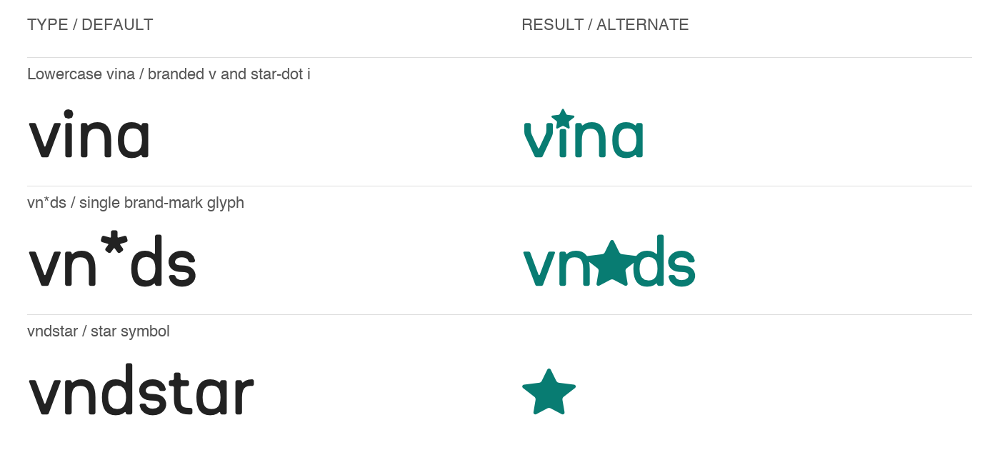
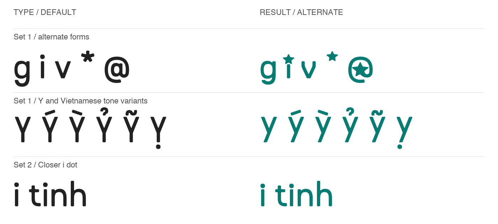
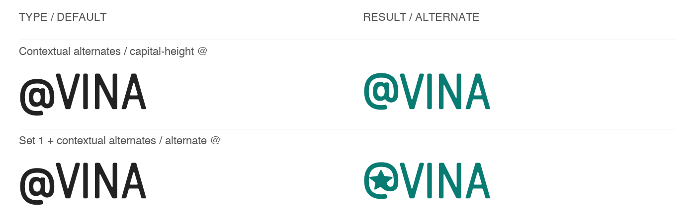

# Vina Ép Kim

A variable typeface with Vietnamese support, upright and italic styles, and
weights from Regular (400) to Bold (700).

[Download desktop font](https://github.com/vinadesignstore/vina-ep-kim/releases/latest/download/VinaEpKim-VF.ttf) · [Download webfont](https://github.com/vinadesignstore/vina-ep-kim/releases/latest/download/VinaEpKim-VF.woff2) · [All releases](https://github.com/vinadesignstore/vina-ep-kim/releases)

## Install

**macOS or Windows:** Download the desktop TTF, open it, and choose **Install**.
In your design application, select **Vina Ep Kim**. Restart the application if
the font does not appear.

### macOS Command Line

Run this once in Terminal to install the font and its update command:

```sh
curl --fail --location --proto '=https' --proto-redir '=https' \
  https://github.com/vinadesignstore/vina-ep-kim/releases/latest/download/vina-font \
  -o "$HOME/Downloads/vina-font" && bash "$HOME/Downloads/vina-font" install
```

Open a new terminal, then use:

```sh
vina-ep-kim version  # Show the installed release
vina-ep-kim check    # Check for an update
vina-ep-kim update   # Install the latest release
```

No administrator access or GitHub account is needed. Updates verify downloaded
files and back up the previous font. Restart open design apps after updating.

## Styles

Regular, Medium, Semibold, and Bold, each with an italic style. Variable-font
applications can also use intermediate weights (`wght` 400-700) and the italic
axis (`ital` 0-1). Desktop TTF and web WOFF2 formats are included.

## Brand Shortcuts

Type these exact lowercase sequences with **Vina Ep Kim** selected. In apps
with the relevant OpenType features enabled, the branded forms appear as you
type; the underlying text stays editable.



| Type | Result | Enable |
| --- | --- | --- |
| `vina` | Branded `v` and star-dot `i` | Standard Ligatures (`liga`) or Contextual Alternates (`calt`) |
| `vn*ds` | A single VNDS brand-mark glyph | Standard Ligatures (`liga`) |
| `vndstar` | The brand star | Contextual Alternates (`calt`); leave Set 1 off |

Capitalization matters: `VINA` and `VN*DS` do not trigger these shortcuts.
Plain `vnds` is not a shortcut. To keep `vina` in its normal letterforms,
turn off both Standard Ligatures and Contextual Alternates, and leave Set 1 off.

## Alternate Characters



- **Set 1 (`ss01`):** alternate `g`, star-dot `i`, branded `v`, star-shaped
  asterisk, star-inside `@`, and alternate `Y`, including `Ý Ỳ Ỷ Ỹ Ỵ`.
- **Set 2 / Closer i dot (`ss02`):** brings the lowercase `i` dot halfway
  closer to its stem. Leave Set 1 off to use this instead of the star-dot `i`.
- **Individual alternates:** use your app's Glyphs or alternates picker to
  replace only selected characters instead of applying a whole set.

The automatic `vina` shortcut keeps its star-dot `i`, even with Set 2 enabled.
Disable the shortcut's features to use the closer round dot in that word.

### Stacked Vina Design Store Logo

Type the name in lowercase, with a line break after each word:

```text
vina
design
store
```

- Set **leading / line height to 75% of the font size**: for example, 100 pt
  type with 75 pt leading. On the web, use `line-height: 0.75`.
- Turn off **Standard Ligatures** and **Contextual Alternates** so `vina`
  does not automatically use the star-dot `i`.
- Enable **Closer i dot / Set 2 (`ss02`)** for the text.
- Select only the `g` in `design` and choose its alternate in the Glyphs
  panel, or apply **Set 1 (`ss01`) to that character only**. Do not enable
  Set 1 for the whole logo, since it also replaces the `i` with a star-dot form.

### Contextual @

With Contextual Alternates enabled, `@` adjusts before an uppercase letter,
including Vietnamese capitals. This also works with the Set 1 star-inside `@`.



## Using the Features

**Illustrator:** select the text, then open **Window → Type → OpenType**.
Enable **Standard Ligatures** and **Contextual Alternates** for the shortcuts.
Use **Stylistic Sets** to select Set 1 or **Closer i dot / Set 2**. For a single
alternate, open **Window → Type → Glyphs** and choose an alternate for the
selected character. See Adobe's guides to
[ligatures](https://helpx.adobe.com/uk/illustrator/desktop/design-with-text/special-characters-glyphs/use-ligatures-and-contextual-alternates.html)
and [stylistic sets](https://helpx.adobe.com/ca/illustrator/desktop/design-with-text/special-characters-glyphs/add-stylistic-sets-to-selected-text.html).

**Other design apps:** look for OpenType features in the text or typography
settings. Availability and labels vary; typing a shortcut alone is not enough
if its feature is disabled or unsupported.

**Web:** after loading the WOFF2 with `@font-face`, apply the features to the
relevant text:

```css
.vina { font-family: "Vina Ep Kim", sans-serif; }
.brand { font-feature-settings: "liga" 1, "calt" 1; }
.alternates { font-feature-settings: "ss01" 1; }
.close-dot { font-feature-settings: "ss01" 0, "ss02" 1; }
.plain { font-feature-settings: "liga" 0, "calt" 0, "ss01" 0; }
```

Apply `.vina` plus the desired feature class. If combining feature choices,
include all desired settings in one `font-feature-settings` declaration.

## Help

- **Command not found:** Open a new terminal or run `export PATH="$HOME/.local/bin:$PATH"`.
- **Unknown version:** Run `vina-ep-kim update` to identify or update a manually installed font.
- **Download failed:** Check your connection and the [releases page](https://github.com/vinadesignstore/vina-ep-kim/releases). Your installed font is left unchanged.
- **Still seeing the old font:** Restart the app and reselect **Vina Ep Kim**.

Report problems through [GitHub Issues](https://github.com/vinadesignstore/vina-ep-kim/issues).

## License

No distribution license has been selected. Public availability does not grant
permission to redistribute or modify the font.
